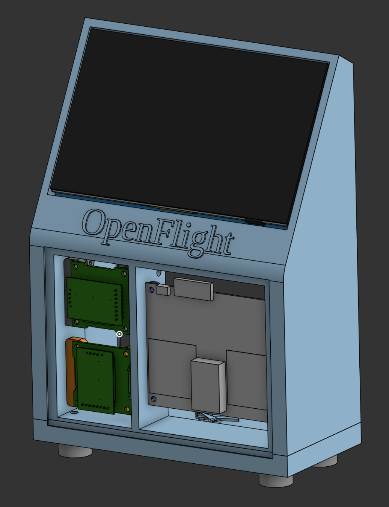

M5 Bolts needed: 18
Front piece of glass size: 166mm width x 115mm length x 2mm thick
Back piece of glass size: 166mm width x 225mm length x 2mm thick

Instructions for OpenFlight Case Build
  
1. Start by printing (1x) ```outer_case_top.stl```. This part will house pretty much everything. 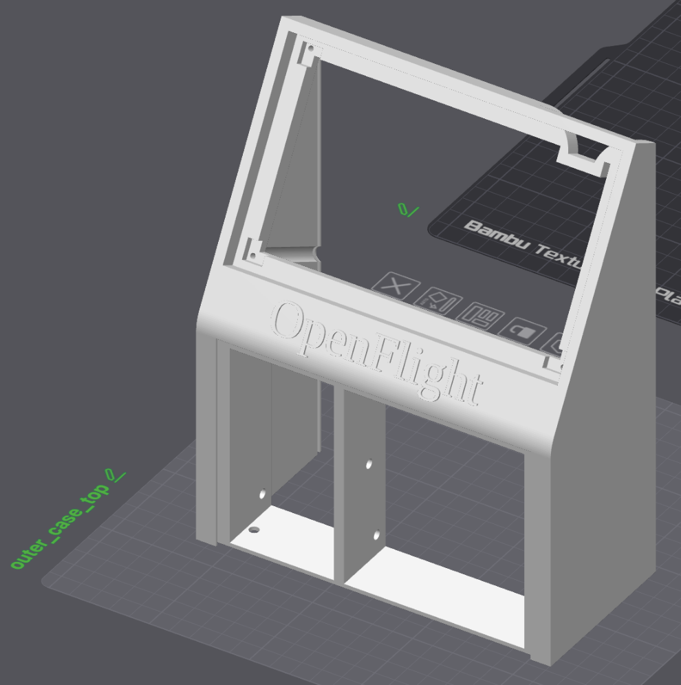
2. Print (2x) ```OPS_mount``` parts. These secure onto the OPS243 sensor.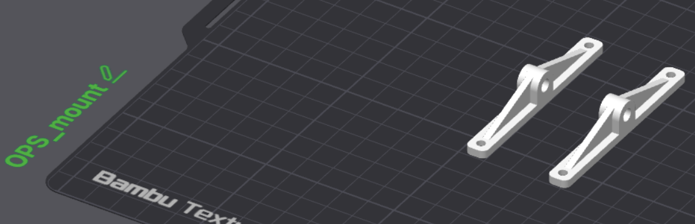
3. Once both mounts are secured to the OPS sensor, use (2x) M5 bolts to screw the entire OPS assembly into the larger left side of the outer_case_top part. Make sure the OPS assembly doesn’t protrude beyond the wall of the ```outer_case_top``` part. NOTE: I don’t know what screws are used for the OPS board itself…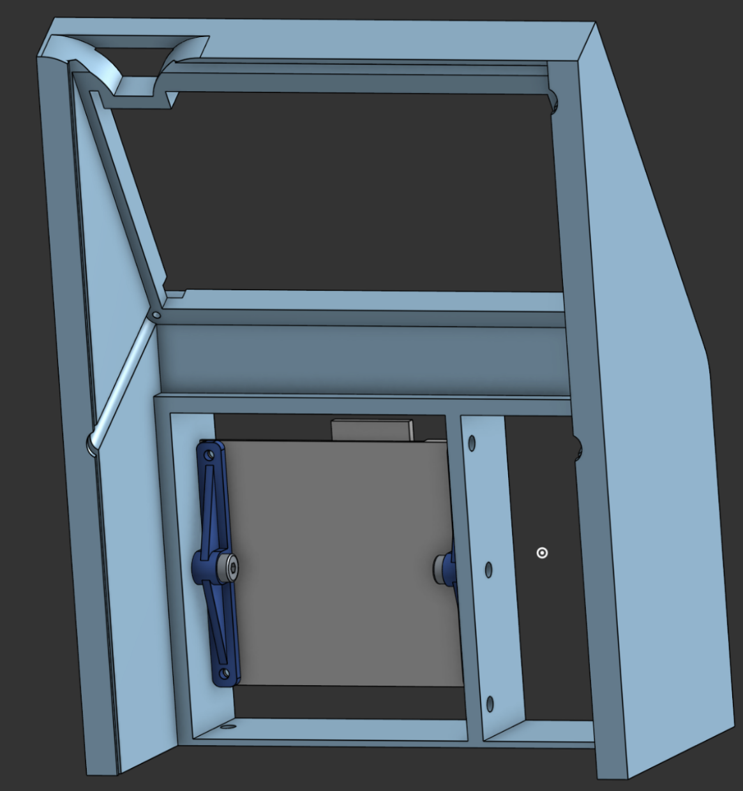
4. Print (1x) ```KLD7_v_mount_L.stl``` and (1x) ```KLD7_v_mount_R.stl```. These will mount to one of the KLD7 sensors, and secure it in the vertical position.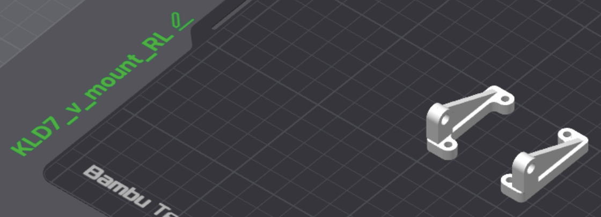
5. Use (2x) M5 bolts to secure the vertical KLD7 assembly into the lower section on the right side of the ```outer_case_top``` part.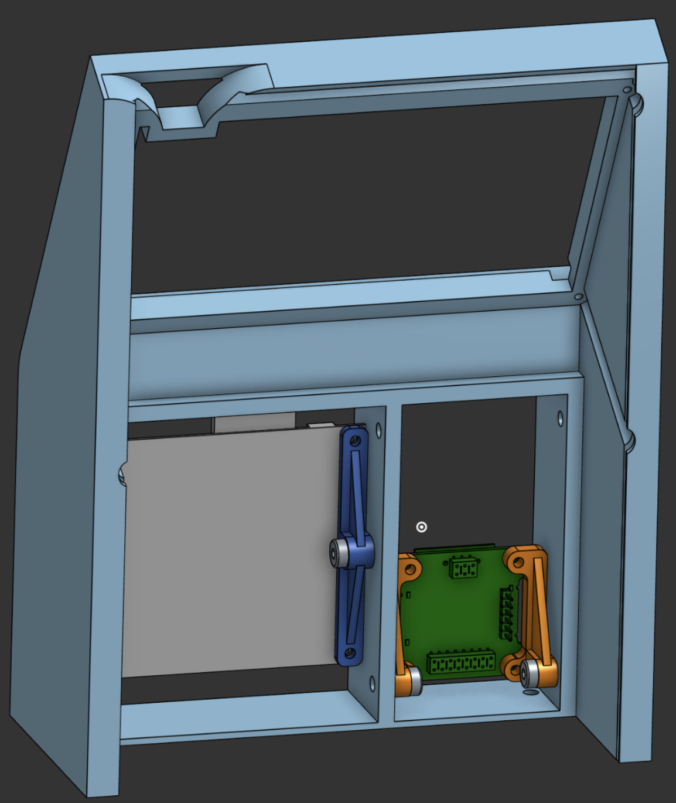
6. Print (1x) ```KLD7_h_mount_L.stl``` and (1x) ```KLD7_h_mount_R.stl```. These will mount to the other KLD7 sensor, and secure it in the horizontal position.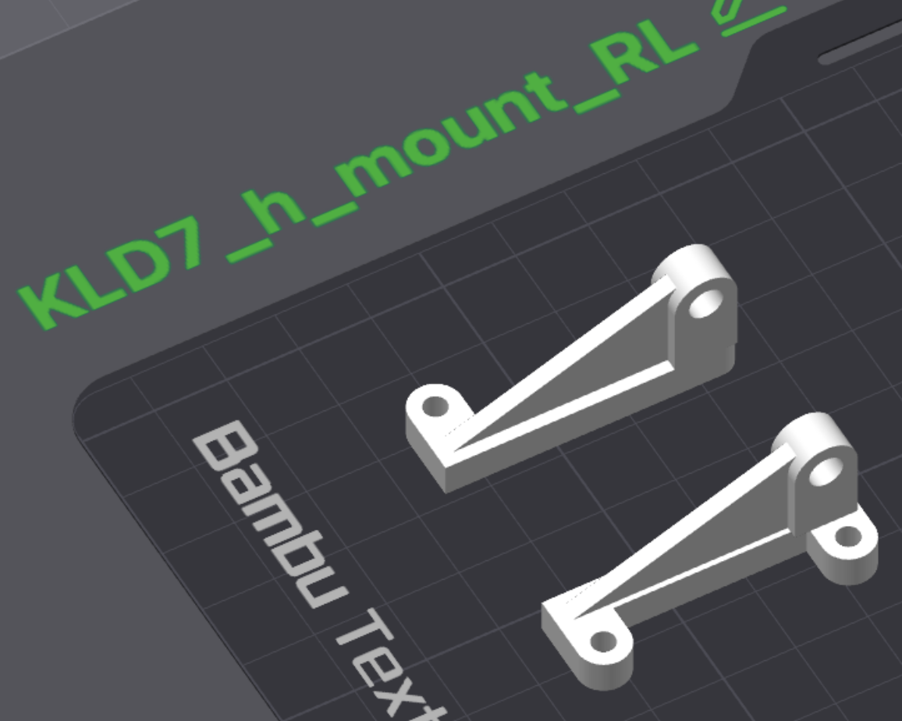
7. Use (2x) M5 bolts to secure the horizontal KLD7 assembly into the upper section on the right side of the ```outer_case_top part```.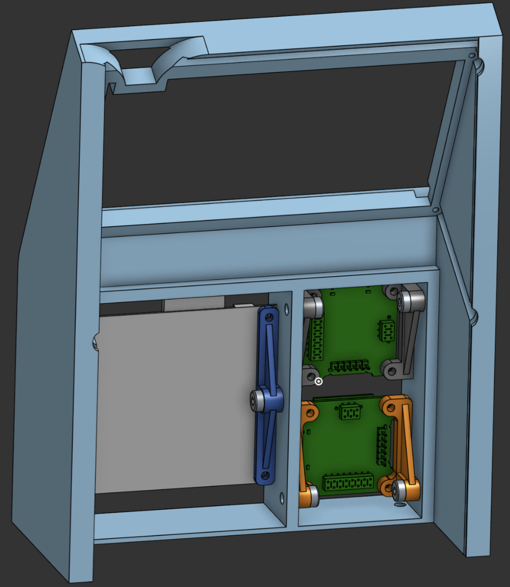
8. Print out (1x) ```outer_case_bottom.stl``` 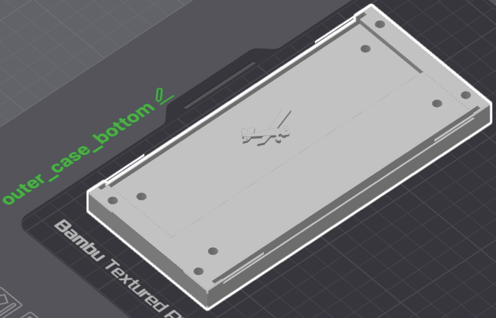
9. Print out (4x) ```case_foot.stl``` parts.
10. Use (4x) M5 bolts to secure each ```case_foot``` part to the underside of the ```outer_case_bottom``` part. 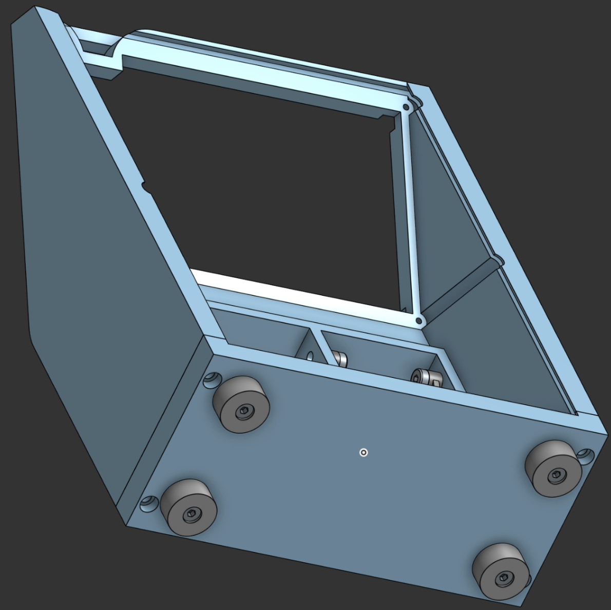
11. Use (4x) M5 bolts to secure the ```outer_case_bottom``` to the ```outer_case_top part```. 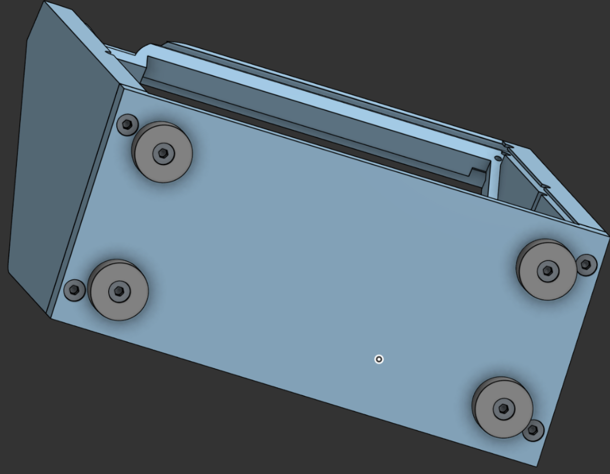

And that’s how you put together the 3d printed parts!
